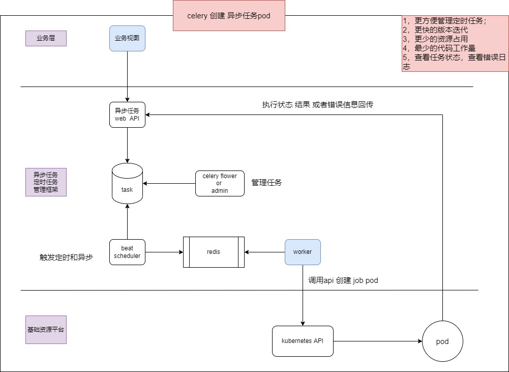

# cks
kubernetes celery task server
需求： 原django 单体服务 使用celery 作为分布式异步框架， 拆分微服务后，需要一个统一的异步（定时）任务框架。

设计目标：改造工作量最小，资源耗用量最小。

# 设计架构图

# 准备工作
python manage makemigrations 
python manage.py createsuperuser
# 启动worker
celery  -A worker CKS

# 启动beat
celery -A CKS beat -l info --scheduler beat.schedulers:DatabaseScheduler  #启动beta 调度器使用数据库

# 启动 flower
$ celery -A CKS flower --port=5555